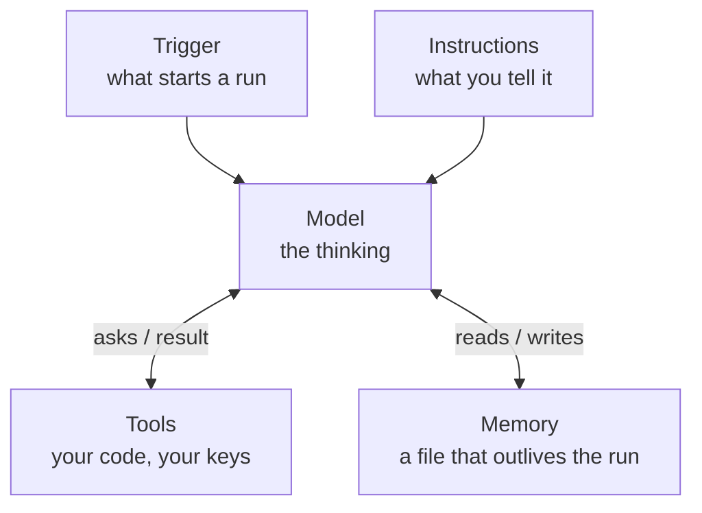

*Part 1 of [Your First Agent](README.md).*
*This is a draft being tested before publication. Found something confusing or wrong? [Open an issue](../../issues) with the post, the section, and what happened.*

# What an agent actually is

Everyone is selling you agents. Almost nobody will tell you what one is in terms you could build. Here's the whole thing: an agent is a model, some instructions, some tools, some memory, and a trigger. Five boxes. In this series you build all five yourself. The first working agent is one Python file of about 65 lines, and the loop that makes it an agent is about 30 of them. You can read the whole thing in ten minutes. By the end, it runs on a schedule, keeps a record of everything it does, and has grown into a few small files, each split out for a reason you'll have felt first.

## The five boxes

**The model** is the LLM. The same thing behind ChatGPT or Claude, reached over an API instead of a chat window. It does the thinking. It can't do anything else. On its own, a model is a brain in a jar: brilliant, and completely unable to touch the world.

**Instructions** are what you tell the model, in plain English: who it is, what the job is, and what to do when it's done. In a chat window you type all that fresh every time. In an agent it's written down once and sent with every call, so each run starts knowing its job. Most people call this the prompt, and a lot of writing treats the prompt as the whole agent. It isn't. Instructions can only ask. Nothing you write in them stops the model doing anything. What the agent can and can't do is set by the next box.

**Tools** are how it touches the world. A tool is just a function you wrote, described to the model so it knows the function exists. The model can't run your code. It can only ask. "Please run list_files for me." You run it, hand back the result, and the model carries on. That request-and-response arrangement matters more than any framework: your code holds the keys the entire time. It's also why the instructions aren't the safety net. An instruction is a request. A tool is a fact. The agent can't delete a file you never gave it a tool to delete.

**Memory** is anything the agent knows that outlives one run. This gets dressed up in a lot of vector database mysticism, so here's the version nobody sells conference tickets for: memory can be a text file. The agent reads it when it starts, updates it when it finishes. You can open the file and see exactly what your agent knows. That's what we'll build, and it'll be enough.

**The trigger** is whatever starts a run. This is the box most explanations skip, and it's the one that separates an agent from a chatbot. A chatbot waits for you to type. An agent gets triggered.

One more thing about instructions, because it saves confusion later. In the code they live in three places, and each sits next to the thing it describes. The standing instructions, who you are and what to do at the end, sit with the model call. The task for this run, "tidy this folder", arrives with the trigger, because whoever starts the agent says what it's for. And every tool carries a one-line description that tells the model when to use it. Three places, one box.

## The trigger ladder

Triggers come in an escalation ladder:

1. **You run it.** You type a command, the agent does a job, it stops. A power tool.
2. **The clock runs it.** Every morning at 7am, whether you remembered or not.
3. **An event runs it.** A file lands in a folder. An email arrives. The agent reacts.
4. **It runs itself.** Check, act, sleep, repeat. Full autonomy.

This series climbs the first two rungs, and shows you what it takes to stand safely on the second. Rungs 3 and 4 use the same agent with a different trigger, and they only make sense once you trust rung 2.

Here's the part that should lower your blood pressure: the agent itself barely changes between rungs. The loop, the instructions, the tools and the memory you build at rung 1 are the same at rung 2. What changes is everything that assumed you were watching: who approves changes, where the results go, and how much you trust it with nobody there. That trust question gets two whole posts: one on putting the agent on a schedule, and one on what production means once nobody is watching.

A note on definitions, because you'll meet other ones. Most industry writing defines an agent by its inner behaviour: a model that decides for itself which tools to use and in what order, looping until the job is done. That's true, and our agent works exactly that way. I just find it a poor place to start, because it describes the machinery rather than the experience. The thing that'll actually change your week isn't that the model picks its own tools. It's that something useful happened and you weren't there. That's the trigger.

## Does this need an agent?

Before building anything, ask a less exciting question: does this job need AI at all?

A lot of what gets built with AI right now doesn't. People ask a chatbot things a search engine answers faster. They build an "agent" to convert PDFs into another format, a job ordinary software has done reliably for years. It works, sort of, but it's slower and less reliable, and it costs money every single time it runs.

Here's a simple way to decide. Call it the right-tool check: a ladder of four options. Work down it, cheapest first, and stop at the first step that does the job:

1. **Something that already exists.** A search engine, a spreadsheet formula, a feature already in an app you use.
2. **A script.** If you can write the rule down, and the same input should always give the same output, write a script. Converting files, renaming by date, checking that the numbers add up. A script gives the same answer every time and costs nothing to run.
3. **One AI call.** If the job needs judgement about meaning, but only once, ask the model once. Summarise this. Is this email a complaint? Pull out the names and dates.
4. **An agent.** Only if the job needs judgement *and* a series of decisions about what to do next, in an order you can't spell out in advance. "Tidy this folder" qualifies. Nobody can write the rule, because it depends on what's in the files, and the work takes several steps: look, read, decide on groups, move things.

Most real jobs are mostly script with a small judgement part hiding inside. Split them. Let ordinary code do the mechanical part, and pay the model only for the part that needs thinking. The agent in this series works exactly that way: listing files and moving them is plain code, and the model only makes the decisions.

## What this is not

Building an agent doesn't require a framework, an orchestration platform, or anything with "AI" in its pricing page. Those exist for real reasons, and you'll understand those reasons because you'll have built the small version first.

That includes the big things. A multi-agent workflow is agents wired together through boxes you already have. One agent's output lands somewhere, and that landing is the next agent's trigger. An "orchestrator" is an agent whose tools are other agents. Two agents "talking" are writing to and reading from a file they share, which is memory. An "LLM as a judge" is a model used as a tool or as a scorer, never a new kind of part. The agent you build in this series is small, but it isn't a toy version of those systems. It's the unit they're made of. What gets hard at scale isn't the boxes. It's the questions from the production post, asked once per agent.

So when someone eventually shows you a diagram with fourteen boxes, you'll be able to point at each one and say: model, instructions, tool, memory, trigger, and nine boxes of packaging.

## At home or at work?

This series assumes you're at home: your own computer, and your own API account paid for with your own money. That's not the same as a Claude or ChatGPT subscription, and the setup post explains the difference.

If you want to do this at work, check a few things first. Some are rules that apply to you whether anyone mentions them or not.

- **Can you install the software?** The course needs Python, an editor, git and one Python package. Many companies control what goes on their machines, and some block installing software altogether.
- **Does your company have its own AI endpoint?** Many route AI through a controlled service, such as Microsoft Foundry or an API gateway like Azure API Management, so they can see what's sent and who sent it. If yours does, a personal API key is probably the wrong door, and work files certainly shouldn't go through it. An agent reads files and sends their contents to the model. At work, those files are the company's data.
- **Is there an AI policy that covers building agents?** Some companies need you to get approval first, or to list every agent in a register. The last post in this series builds a small register, so you'll know what goes in one.

If you don't know the answer to any of these, the answer is that you don't know. Ask before you start. It's always safer, and a short conversation with IT now costs much less than explaining an agent later.

## Try this

Before the next post, pick a job you'd like an agent to do. Good candidates are boring, repetitive and full of text. A messy folder that needs sorting. Notes that need summarising. A weekly file that needs checking.

Now run it through the right-tool check. Could an existing tool do it? Could you write the rule down as a script? Does it need judgement once, or a string of decisions? Be honest. If it lands on a script, you've just saved yourself an agent, and that's a win.

If it really does need an agent, write one sentence: "I want an agent that ___ every ___." Keep it. In the build posts we make one, and at the end you'll know how to build yours.

*Further reading: if you already write Python and want the one-sitting version of this idea, Bob Belderbos's [There Is No Magic: An AI Agent in 60 Lines of Python](https://belderbos.dev/blog/build-minimal-ai-agent-python/) builds the same loop with a fake model and no API key. This series is the slower road to a real one.*

*As of September 2026, one run of the agent in this series costs a few pence. You'll need about £5 of API credit for the whole course, including the post where we test it against three models. Details next time.*

---

[Series page](README.md) · [Part 2](02-setting-up.md) →
