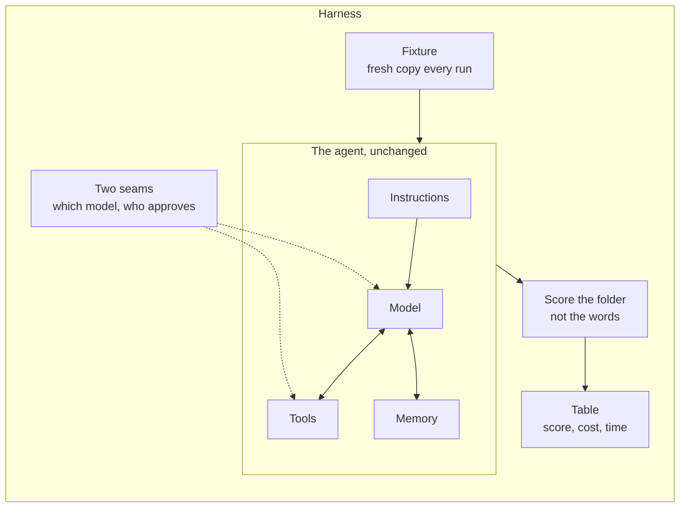

*Part 7 of [Your First Agent](README.md).*
*Code for this post: [`lessons/07-swap-the-model`](../lessons/07-swap-the-model).*
*This is a draft being tested before publication. Found something confusing or wrong? [Open an issue](../../issues) with the post, the section, and what happened.*

# Swap the model: build a harness that tells you if it helped

A new model comes out every few weeks, and every announcement says it's better. Better at what? For *your* agent, doing *your* job? Would it be worth paying three times as much?

You can't answer that by running the agent once on each model and eyeballing the result. This post builds a **harness**: a small program that runs your agent under controlled conditions and scores what it did. The same messy folder, the same task and the same tools every time. The only thing that changes is the model. By the end you'll have a real table of scores and costs, and you'll know how to read it.

Two ideas carry this post, and they matter far beyond this agent:

- **Score the result, not the words.** We don't judge the agent on what it *says* it did. We look at the folder afterwards and check.
- **You can only test an agent that was built to be tested.** Our agent needs two small changes before a harness can drive it.

**Start of session:** VS Code open on `my-first-agent`, a new terminal, `(.venv)` showing, key set. If anything fails, the setup post's "When it goes wrong" section has the fixes. Your finished files match `lessons/07-swap-the-model` in the course files.

## Setup: a clean copy to test

We'll test the simple agent from the "Give your agent hands and a memory" post, not the scheduled production one. The harness only needs the loop, the instructions, the tools and the memory. The schedule, reports and spend guard would only get in the way here. That means you'll have two agents for a while, the one you run and the one you test. It's a pain, and the post after this one fixes it by pointing the harness at the real agent.

1. In the VS Code sidebar, create a folder called `harness` inside `my-first-agent`.
2. Copy `lessons/04-hands-and-memory/agent.py` from the course files into `harness`.
3. In the terminal, move into the new folder:

```bash
cd harness
```

`(.venv)` stays on. It belongs to the terminal, not the folder. **Checkpoint: `pwd` (Mac) or `Get-Location` (Windows) ends in `harness`.**

## Step 1: two seams in the agent

Here's the whole post in one picture. The five boxes from the first post are inside, unchanged. The harness wraps them: it supplies the folder, chooses the model, answers the approvals, and scores what's left behind. Notice there's no trigger box inside the wrapper. The harness *is* the trigger.



**Every edit in this step is to `harness/agent.py`, the copy you just made.** Open that one in VS Code and check the tab's path before you type. Leave the `agent.py` in `my-first-agent` alone.

A **seam** is a place where you can change how code behaves without rewriting it. The agent has two things a harness must control and currently can't.

**The model is fixed.** `model="claude-haiku-4-5"` is typed into the loop. A harness that swaps models needs it to be a setting.

**Approval needs a person.** `input()` waits for someone to type y. A harness can't type. It needs to answer approvals itself.

### 1a. Approval becomes a function

Above `write_file`, add:

```python
def ask_human(question):
    return input(f"\n  {question} [y/n] ").strip().lower() == "y"
```

It's the same question and the same "did they type y?" check the tools already have, moved into one function that returns `True` or `False`. People will use this one. The harness will bring its own.

### 1b. Tools take their approver as an input

Change the first lines of `write_file` from:

```python
def write_file(workspace, name, content):
    answer = input(f"\n  Agent wants to write '{name}' - allow? [y/n] ")
    if answer.strip().lower() != "y":
```

to:

```python
def write_file(workspace, name, content, approve):          # SEAM 2: approve is passed in
    if not approve(f"Agent wants to write '{name}' - allow?"):
```

Then do the same to `move_file`. Change its first lines from:

```python
def move_file(workspace, name, new_name):
    answer = input(f"\n  Agent wants to move '{name}' -> '{new_name}' - allow? [y/n] ")
    if answer.strip().lower() != "y":
```

to:

```python
def move_file(workspace, name, new_name, approve):
    if not approve(f"Agent wants to move '{name}' -> '{new_name}' - allow?"):
```

In both functions, three lines become two. The `answer = input(...)` line and the old `if answer...` line both go, and the new `if not approve(...)` line takes their place. The `return "The user declined..."` line underneath stays where it is.

`approve` is a new input, and it's a *function*. In Python you can pass a function around like any other value, then call it. `write_file` no longer knows or cares who is deciding. It asks whatever approver it was given. That's the whole idea of a seam: the tool stays the same, and the decision gets plugged in from outside.

### 1c. Pass the approver through

The tools are called from `run_tool`, so it needs to hand the approver on. Three lines change, and each one only gains `approve` at the end of its brackets.

Change the first line of `run_tool` from:

```python
def run_tool(workspace, name, args):
```

to:

```python
def run_tool(workspace, name, args, approve):
```

Inside it, change the `write_file` route from:

```python
            return write_file(workspace, args["name"], args["content"])
```

to:

```python
            return write_file(workspace, args["name"], args["content"], approve)
```

and the `move_file` route from:

```python
            return move_file(workspace, args["name"], args["new_name"])
```

to:

```python
            return move_file(workspace, args["name"], args["new_name"], approve)
```

The `list_files` and `read_file` routes don't change. Those tools never asked permission, so they have no approver to pass.

### 1d. `main` becomes `run`, with settings

Change the first three lines of `main` from:

```python
def main():
    workspace = pathlib.Path(sys.argv[1])
    task = sys.argv[2]
```

to:

```python
def run(workspace, task, model="claude-haiku-4-5", approve=ask_human, quiet=False):
    """Run the agent once. Returns what a harness needs to know about the run."""
```

and add one line under `client = anthropic.Anthropic()`:

```python
    stats = {"input_tokens": 0, "output_tokens": 0, "tool_calls": 0}
```

- The folder and task are no longer read from the command line inside the function. They're passed in, so the harness can supply them.
- `model="claude-haiku-4-5"` means "use Haiku unless told otherwise". A value after `=` is a **default**. Run the agent by hand and nothing changes. The harness can say `model="claude-sonnet-5"`.
- `approve=ask_human` does the same for approval: a person by default, anything else if you pass it.
- `quiet=False` lets the harness switch off the printing, so nine runs don't bury your screen.
- The line in quotes under `def` is a **docstring**, a description of the function that editors show when you hover over its name.
- `stats` will count what each run used.

### 1e. Use the settings inside the loop

In `client.messages.create(...)`, change `model="claude-haiku-4-5",` to:

```python
            model=model,                    # SEAM 1: the model is a parameter
```

Straight after the closing `)` of that call, add:

```python
        stats["input_tokens"] += response.usage.input_tokens
        stats["output_tokens"] += response.usage.output_tokens
```

A few lines further down, find the line that prints what the model says. Change it from:

```python
            if block.type == "text" and block.text.strip():
```

to:

```python
            if block.type == "text" and block.text.strip() and not quiet:
```

Only the end of the line changes: `and not quiet` goes in before the colon. The `print` line underneath stays as it is.

Replace `print(f"  [tool] {block.name}")` with:

```python
                stats["tool_calls"] += 1
                if not quiet:
                    print(f"  [tool] {block.name}")
```

In the `run_tool(...)` call, pass the approver along. Change the line from:

```python
                    "content": run_tool(workspace, block.name, block.input),
```

to:

```python
                    "content": run_tool(workspace, block.name, block.input, approve),
```

And after the loop, at the end of the function, send the numbers back. The new line goes straight after the `messages.append(...)` line that ends the loop:

```python
        messages.append({"role": "user", "content": results})
    return stats
```

Mind the indentation. `return stats` is four spaces in, level with the `for` line, which puts it inside `run` but after the loop. Indentation is how Python decides what belongs to what. At eight spaces the line would be inside the loop, and the agent would stop after its first round. With no indent it would be outside the function, and Python would refuse to run the file.

### 1f. A new, tiny `main`

Straight after `run`, above the `if __name__` line, add:

```python
def main():
    run(pathlib.Path(sys.argv[1]), sys.argv[2])
```

Running the agent by hand now goes through `run` with every default: Haiku, a human approver, printing on. Copy the `demo` folder from `lessons/04-hands-and-memory` into `harness` and check nothing has broken:

```bash
python agent.py demo "What kinds of files are in this folder?"
```

**Checkpoint: `harness/agent.py` behaves exactly as the agent did before.** Adding seams shouldn't change behaviour. If it has, compare your file with the repo's.

## Step 2: a fixed test, with an answer key

A fair comparison needs the same test every time. Copy two things from `lessons/07-swap-the-model` in the course files into your `harness` folder:

- **`fixture/`** holds fifteen badly named files. A **fixture** is test material that never changes. There are four bills and receipts, four recipes, four sets of meeting notes and three travel documents, with names like `asdfgh.txt`, `copy of copy.txt` and `IMG_0042.txt`. One file is a trap: `receipt.txt` is a restaurant bill listing risotto and tiramisu. It's money, but it reads like food, and it tempts a model into filing it under recipes.
- **`answer_key.json`** says which files belong together:

```json
{
  "money": ["IMG_scan_001.txt", "download (3).txt", "doc_final_FINAL.txt", "receipt.txt"],
  "recipes": ["Untitled document.txt", "asdfgh.txt", "notes2.txt", "New Text Document (2).txt"],
  "meetings": ["mtg.txt", "stuff.txt", "copy of copy.txt", "temp.txt"],
  "travel": ["IMG_0042.txt", "final.txt", "untitled (1).txt"]
}
```

The group names don't matter. The agent will never see this file. It records which files *belong together*, and that's all we'll score. Every file's contents are different, which matters in step 3.

**Checkpoint: `harness` contains `agent.py`, `demo`, `fixture` (15 files) and `answer_key.json`.**

## Step 3: the harness

Create `harness.py` in the `harness` folder. We'll build it in five parts. Each part goes at the bottom of the file, below the one before it, starting at the left margin with a blank line in between. Nothing in this step is typed inside an earlier part.

### 3a. Imports and settings

```python
import hashlib
import itertools
import json
import pathlib
import shutil
import sys
import tempfile
import time

import agent

MODELS = {                      # price per million tokens (input, output), as of Sept 2026
    "claude-haiku-4-5": (1.00, 5.00),
    "claude-sonnet-5": (2.00, 10.00),
    "claude-opus-5": (5.00, 25.00),
}
TASK = "Organise this folder: group the files into sensibly named subfolders. Rename them if it helps."
HERE = pathlib.Path(__file__).parent
```

The new imports, briefly:

- `hashlib` makes a **fingerprint** of a file's contents. More in 3b.
- `itertools` has a helper for making every possible pair, used in 3c.
- `shutil` copies whole folders. `tempfile` creates a throwaway folder that deletes itself afterwards.
- `time` measures how long each run takes.
- `import agent` loads your `agent.py`. This is why the `if __name__` line matters: importing the agent doesn't start it.

`MODELS` lists the models to compare, with their price per million tokens for input and output. The prices change, so check Anthropic's pricing page and update them. `TASK` is the same instruction every run.

### 3b. Where did each file end up?

The agent renames files, so after a run we can't look for `asdfgh.txt` by name. It may now be `Recipes/Weeknight_Chilli.txt`. But moving and renaming never change what's *inside* a file, so we identify files by their contents. Below the `HERE` line, add:

```python
def fingerprint(path):
    return hashlib.sha256(path.read_bytes()).hexdigest()

def where_did_files_go(workspace, originals):
    """Map each original filename to the folder it ended up in. Contents identify files, so renames are fine."""
    by_content = {fingerprint(HERE / "fixture" / name): name for name in originals}
    placed = {}
    for path in workspace.rglob("*"):
        name = by_content.get(fingerprint(path)) if path.is_file() else None
        if name and path.parent != workspace:
            placed[name] = str(path.parent.relative_to(workspace))
    for name in originals:
        placed.setdefault(name, f"UNGROUPED:{name}")   # left at the top, or lost: sits alone, scores as wrong
    return placed
```

- `fingerprint` reads a file and returns its **SHA-256 hash**: a long code calculated from the contents. Identical contents always give the same code, and different contents give different codes. That's also the scorer's one assumption: every fixture file has different contents. If you add files to the fixture later, make sure no two are identical, or the scorer can't tell them apart.
- `by_content` is a lookup table from each original file's fingerprint to its original name.
- The loop goes through every file in the folder after the run. If its fingerprint matches an original, we record which subfolder it's in, whatever it's now called. Files the agent creates, like `memory.md`, match nothing and are ignored.
- `path.parent != workspace` skips files still sitting at the top of the folder. They haven't been grouped.
- The final loop gives every file that wasn't found in a subfolder a label of its own, so it counts as grouped with nothing. An agent that does nothing scores zero, which is right.

### 3c. The score

Now the scoring. Look at every **pair** of files. For each pair the answer key says either "these belong together" or "these don't". Then check the folder: did the pair end up together?

Do it by hand once, on something small, before you type any code.

Take four files. The answer key says two are recipes (chilli, soup) and two are bills (gas, phone). The agent sorts them badly. It puts chilli, soup and gas in a folder called Food, and leaves phone alone in Bills.

Four files make six pairs. Ask each pair two questions:

| Pair | Should be together? | Ended up together? |
|---|---|---|
| chilli + soup | yes | yes |
| chilli + gas | no | yes |
| soup + gas | no | yes |
| chilli + phone | no | no |
| soup + phone | no | no |
| gas + phone | yes | no |

Count down the columns. Two pairs should be together. Three pairs ended up together. Only one pair, chilli + soup, has a yes in both columns. Call those counts `should`, `did` and `both`: 2, 3 and 1.

- **Recall** is `both / should`, here 1 out of 2. Of the pairs that belong together, what share got put together? The agent split the bills, so it loses marks.
- **Precision** is `both / did`, here 1 out of 3. Of the pairs that got put together, what share really belong together? The agent lumped gas in with the food, so it loses marks here too.
- **F1** combines the two into one number from 0 to 1. For this sort it comes to 0.4.

The function below is that table, and nothing more. Below `where_did_files_go`, add:

```python
def grouping_score(placed, answer_key):
    """F1 over pairs: of the pairs that belong together, how many ended up together, without lumping in wrong ones."""
    truth = {name: group for group, names in answer_key.items() for name in names}
    should = did = both = 0
    for a, b in itertools.combinations(truth, 2):
        together_in_key = truth[a] == truth[b]
        together_now = placed[a] == placed[b]
        should += together_in_key
        did += together_now
        both += together_in_key and together_now
    if both == 0:
        return 0.0
    precision, recall = both / did, both / should
    return 2 * precision * recall / (precision + recall)
```

Read it against the table:

- `truth` flips the answer key round, so you can look up any file's group.
- `itertools.combinations(truth, 2)` writes the first column: every pair, listed once. `itertools` is a toolbox that comes with Python, and `combinations` is the tool in it that lists pairs so you don't have to write the loops yourself. Our fixture has 15 files, which makes 105 pairs.
- `together_in_key` and `together_now` are the two yes/no columns.
- The three `+=` lines count down the columns. In Python, `True` counts as 1 and `False` as 0, so adding a comparison adds 1 or nothing.
- The last two lines do the division and combine the results into F1.

F1 is only high when precision and recall are both high, and that stops a lazy agent cheating. Put all four files in one folder and every pair is together: recall is perfect, but precision drops to 2 out of 6 and the score is 0.5. Give every file its own folder and no pair is together, so the score is 0.

Why pairs? Because folder names don't matter. "Invoices", "Bills" and "Money" are all correct. Pairs only ask whether things that belong together ended up together.

Before trusting a score, test it. In the terminal:

```bash
python -c "import json, harness as h; k = json.load(open('answer_key.json')); perfect = {n: g for g, ns in k.items() for n in ns}; print(h.grouping_score(perfect, k))"
```

That builds a perfect placement straight from the answer key and scores it. **Checkpoint: it prints `1.0`.**

Now score the bad sort from the table. You already know the answer it should give:

```bash
python -c "import harness as h; key = {'recipes': ['chilli', 'soup'], 'bills': ['gas', 'phone']}; placed = {'chilli': 'Food', 'soup': 'Food', 'gas': 'Food', 'phone': 'Bills'}; print(h.grouping_score(placed, key))"
```

**Checkpoint: it prints `0.4`**, the number you worked out by hand.

When I built this, testing the score before spending any money caught a bug: an agent that did nothing at all scored 0.33. That's why 3b labels files left at the top level separately.

### 3d. One run

Below `grouping_score`, add:

```python
def run_once(model, answer_key):
    approvals = []
    def always_yes(question):
        approvals.append(question)
        return True
    with tempfile.TemporaryDirectory() as tmp:
        workspace = pathlib.Path(tmp) / "fixture"
        shutil.copytree(HERE / "fixture", workspace)      # a fresh mess every run
        started = time.time()
        stats = agent.run(workspace, TASK, model=model, approve=always_yes, quiet=True)
        seconds = time.time() - started
        placed = where_did_files_go(workspace, [n for names in answer_key.values() for n in names])
    price_in, price_out = MODELS[model]
    cost = (stats["input_tokens"] * price_in + stats["output_tokens"] * price_out) / 1_000_000
    return {"score": grouping_score(placed, answer_key), "cost": cost, "seconds": seconds,
            "tool_calls": stats["tool_calls"], "approvals": len(approvals)}
```

- `always_yes` is the harness's approver. It says yes to everything and notes each question in `approvals`, so we can count them. This is seam 2 in action.
- `tempfile.TemporaryDirectory()` creates a throwaway folder that deletes itself when the `with` block ends.
- `shutil.copytree` copies the fixture into it. **Every run gets a fresh copy of the mess.** If runs shared one folder, the second model would find it already tidied, and the comparison would be meaningless. It also means the agent never touches your real `fixture` folder.
- `agent.run(...)` runs your agent with this model, this approver and printing off. This is seam 1 in action.
- After the run we find where the files went, work out the cost from the token counts, and return everything we measured.

### 3e. Every model, several times

Finally, at the very bottom of the file, below `run_once`:

```python
def main():
    runs = int(sys.argv[1]) if len(sys.argv) > 1 else 3
    answer_key = json.loads((HERE / "answer_key.json").read_text())
    print(f"{'model':<18} {'score':>11} {'cost':>8} {'secs':>6} {'tools':>6} {'approvals':>9}")
    for model in MODELS:
        results = [run_once(model, answer_key) for _ in range(runs)]
        scores = [r["score"] for r in results]
        mean = lambda key: sum(r[key] for r in results) / runs
        print(f"{model:<18} {min(scores):.2f}-{max(scores):.2f}  ${mean('cost'):.3f} "
              f"{mean('seconds'):>6.0f} {mean('tool_calls'):>6.0f} {mean('approvals'):>9.0f}")
    print(f"\nscore: lowest-highest over {runs} runs (1.00 = perfect grouping). Other columns: average per run.")

if __name__ == "__main__":
    main()
```

- `runs` is how many times to run each model: 3 unless you type a number after `harness.py`.
- **Why run each model more than once?** The same model, given the same task twice, can make different choices. One run could be lucky or unlucky. So we show the *lowest and highest* score across the runs, not just an average, because the spread is part of the answer.
- `mean` is a tiny function written on one line (a `lambda`) that averages any column across the runs.
- The `print` lines use format codes to line the columns up: `:<18` means left-aligned in 18 characters, `:>6` right-aligned in 6, `.2f` two decimal places.

## Step 4: run it

Start with one run per model. It costs about 40 cents (as of September 2026):

```bash
python harness.py 1
```

It prints nothing while it works. Each model takes between 20 seconds and a minute. **Checkpoint: a table with one row per model.**

Then the real test, three runs per model, about $1.20:

```bash
python harness.py
```

Here's what I got:

| Model | Score (lowest to highest) | Cost per run | Seconds | Tool calls | Approvals |
|---|---|---|---|---|---|
| Claude Haiku 4.5 | 0.62 to 1.00 | $0.036 | 20 | 33 | 16 |
| Claude Sonnet 5 | 1.00 to 1.00 | $0.085 | 35 | 33 | 16 |
| Claude Opus 5 | 1.00 to 1.00 | $0.269 | 51 | 33 | 16 |

Your numbers will differ, especially Haiku's. That's the point.

## Reading the table

**Haiku is cheap and inconsistent.** One of its runs was perfect and another scored 0.62. If you'd tested it once and got the lucky run, you'd have concluded it was just as good as the others. The spread is what tells you it isn't reliable on this task.

**Sonnet was perfect every time, for about two and a half times the cost of Haiku.** For an agent tidying a folder every morning, that's still a few pence.

**Opus was also perfect, for three times the cost of Sonnet, and slower.** On this task the extra capability bought nothing. That isn't a verdict on Opus. It's a verdict on *this task*. A harder fixture might separate Sonnet from Opus, and that's how you'd find out.

**Tool calls and approvals were identical across models.** Every model did the same amount of work in the same way. They differed only in whether the result was right. On a harder task, those columns can separate models too. A model that needs twice as many calls to get the same score costs you more than its price per token suggests.

Three runs is still a small sample, so treat this as a strong hint, not a law. Run five or ten per model before you make a decision that matters.

The bigger lesson: **"which model is best?" has no answer. "Which model is good enough for this job, reliably, at a price I'm happy with?" does,** and now you can measure it.

## Try this

The harness measures *any* change, not only models. Keep the model fixed and try one of these, re-running the harness before and after:

- Rewrite the `read_file` description in `TOOLS` so it's vaguer, such as "Gets a file". Does Haiku's score move?
- Change the system prompt in `agent.py`, for example by adding "Receipts and bills are money, even when they mention food."
- Make the fixture harder: add five more files, including two that could honestly go in either of two groups, and update `answer_key.json`.

Each time, write down your prediction before you run it. Being wrong about which change helps is the most useful thing a harness can show you.

---

← [Part 6](06-what-production-means-for-an-agent.md) · [Series page](README.md) · [Part 8](08-when-to-break-it-up.md) →
